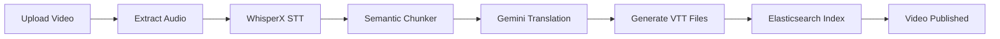

# 🎓 English Video Learning Platform

## 📖 Tổng Quan

Nền tảng học tiếng Anh thông minh qua video với AI, hỗ trợ:
- 🎬 Quản lý video đa cấp độ (A1-C2)
- 🤖 AI Pipeline: WhisperX STT, Semantic Chunking, Translation (8 ngôn ngữ)
- 📝 Phụ đề song ngữ tự động
- 🔍 Tìm kiếm ngữ nghĩa với Elasticsearch
- ✂️ AI Smart Clipper - Cắt clip thông minh
- 📚 Quản lý từ vựng cá nhân
- 👨‍💼 Admin CMS với subtitle editor

---

## 🏗️ Kiến Trúc Hệ Thống

### Stack Công Nghệ

**Backend:**
- **API:** FastAPI (Python 3.11)
- **Database:** MySQL 8.0
- **Cache:** Redis 7
- **Message Queue:** RabbitMQ + Celery
- **Search:** Elasticsearch 8
- **Storage:** MinIO (local) / AWS S3 (production)

**Frontend:**
- **Framework:** Next.js 14 (React 18, TypeScript)
- **Styling:** Tailwind CSS 4 + shadcn/ui
- **State:** React Context + React Query

**AI Services:**
- **Speech-to-Text:** WhisperX (GPU)
- **Semantic Chunker:** spaCy + NLTK
- **Smart Clipper:** Google Gemini API
- **Translation:** Google Gemini API (8 languages)

**DevOps:**
- **Containerization:** Docker + Docker Compose
- **Task Queue:** Celery Workers
- **Monitoring:** Flower (Celery), Elasticsearch Kibana

---

## 📁 Cấu Trúc Dự Án (Monorepo)

```
english-video-learning/
├── docker-compose.yml           # Orchestrate all services
├── .env.example                 # Environment variables template
│
├── backend/                     # FastAPI Backend
│   ├── api/                     # REST API endpoints
│   │   ├── auth.py              # JWT Authentication
│   │   ├── videos.py            # Public video API
│   │   ├── admin.py             # Admin dashboard & CRUD
│   │   ├── vocabulary.py        # User vocabulary
│   │   ├── search.py            # Elasticsearch search
│   │   ├── clips.py             # Clip creation & quota
│   │   └── subtitles.py         # Subtitle management
│   ├── models/                  # SQLAlchemy ORM models
│   │   ├── user.py              # User & roles
│   │   ├── video.py             # Video, Category, Subtitle
│   │   ├── vocabulary.py        # User vocabulary
│   │   ├── transcript.py        # AI-generated transcripts
│   │   └── clip.py              # Clips & quota tracking
│   ├── workers/                 # Celery background tasks
│   │   ├── celery_app.py        # Celery configuration
│   │   ├── video_pipeline.py   # Main orchestrator
│   │   ├── stt_task.py          # WhisperX transcription
│   │   ├── chunking_task.py    # Semantic chunking
│   │   ├── translation_task.py  # Multi-language translation
│   │   ├── indexing_task.py     # Elasticsearch indexing
│   │   ├── clip_task.py         # Clip creation & quota
│   │   └── ffmpeg_task.py       # Video processing
│   ├── services/                # Business logic
│   │   └── storage.py           # MinIO/S3 service
│   ├── core/                    # Core utilities
│   │   ├── config.py            # Settings (12-factor app)
│   │   ├── database.py          # SQLAlchemy session
│   │   └── security.py          # JWT & authentication
│   ├── main.py                  # FastAPI app entry point
│   ├── Dockerfile               # Backend Docker image
│   └── requirements.txt         # Python dependencies
│
├── frontend/                    # Next.js Frontend
│   ├── src/
│   │   ├── app/                 # Next.js App Router pages
│   │   │   ├── page.tsx         # Home - Video list
│   │   │   ├── login/           # Login/Register
│   │   │   ├── watch/[slug]/    # Video player
│   │   │   ├── search/          # Search interface
│   │   │   ├── vocabulary/      # Saved vocabulary
│   │   │   ├── my-clips/        # User clips
│   │   │   └── admin/           # Admin dashboard & CMS
│   │   ├── components/          # React components
│   │   ├── lib/                 # Libraries
│   │   │   ├── api-client.ts    # Axios API client
│   │   │   └── auth-context.tsx # Auth provider
│   │   └── hooks/               # Custom React hooks
│   ├── Dockerfile.dev           # Development Docker
│   ├── package.json             # Node dependencies
│   └── next.config.js           # Next.js config
│
├── ai-services/                 # AI Microservices
│   ├── whisperx/                # Speech-to-Text
│   │   ├── Dockerfile           # GPU-enabled (CUDA)
│   │   ├── api.py               # FastAPI STT endpoint
│   │   └── requirements.txt
│   ├── semantic-chunker/        # Sentence segmentation
│   │   ├── Dockerfile           # spaCy + NLTK
│   │   ├── api.py               # Chunking endpoint
│   │   └── requirements.txt
│   └── smart-clipper/           # Intelligent clip boundaries
│       ├── Dockerfile           # Gemini SDK
│       ├── api.py               # Clipping endpoint
│       └── requirements.txt
│
├── infrastructure/              # Infrastructure as Code
│   ├── local/                   # Local dev configs
│   └── terraform/               # AWS deployment (future)
│
├── shared/                      # Shared types & constants
│   └── types/                   # TypeScript/Python types
│
└── client/ + server/            # [Legacy Express/tRPC - will be removed]
```

---

## 🚀 Quick Start

### Prerequisites

- Docker Desktop + Docker Compose
- Node.js 20+ (for frontend development)
- Python 3.11+ (for backend development)
- GPU with CUDA 11.8+ (optional, for WhisperX)

### 1️⃣ Clone Repository

```bash
git clone <repository-url>
cd english-video-learning
```

### 2️⃣ Setup Environment Variables

```bash
cp .env.example .env
# Edit .env with your configuration:
# - GEMINI_API_KEY (required for AI features)
# - DATABASE_URL (default works with Docker)
# - JWT_SECRET (change in production!)
```

### 3️⃣ Start All Services

```bash
docker-compose up -d
```

This will start:
- **MySQL** (port 3306)
- **Redis** (port 6379)
- **RabbitMQ** (port 5672, management: 15672)
- **MinIO** (API: 9000, console: 9001)
- **Elasticsearch** (port 9200)
- **Backend API** (port 8000)
- **Celery Workers** (background)
- **Celery Beat** (scheduler)
- **Flower** (Celery monitoring: 5555)
- **WhisperX** (port 8001)
- **Semantic Chunker** (port 8002)
- **Smart Clipper** (port 8003)
- **Frontend** (port 3000)

### 4️⃣ Access the Application

- **Frontend:** http://localhost:3000
- **Backend API Docs:** http://localhost:8000/docs
- **Admin CMS:** http://localhost:3000/admin (after login as admin)
- **MinIO Console:** http://localhost:9001 (minioadmin/minioadmin)
- **RabbitMQ Management:** http://localhost:15672 (guest/guest)
- **Flower Dashboard:** http://localhost:5555

### 5️⃣ Create Admin User

```bash
docker-compose exec backend-api python
```

```python
from core.database import SessionLocal
from models.user import User, UserRole

db = SessionLocal()
admin = User(
    open_id="admin123",
    email="admin@example.com",
    name="Admin User",
    role=UserRole.ADMIN
)
db.add(admin)
db.commit()
```

---

## 📚 Development Guide

### Backend Development

```bash
cd backend

# Install dependencies
pip install -r requirements.txt

# Run migrations (if needed)
alembic upgrade head

# Start dev server
uvicorn main:app --reload --host 0.0.0.0 --port 8000
```

### Frontend Development

```bash
cd frontend

# Install dependencies
npm install

# Start dev server
npm run dev
```

### Celery Workers (Background Tasks)

```bash
cd backend

# Start Celery worker
celery -A workers.celery_app worker --loglevel=info

# Start Celery Beat (scheduler)
celery -A workers.celery_app beat --loglevel=info

# Monitor with Flower
celery -A workers.celery_app flower
```

---

## 🤖 AI Pipeline Flow

### Video Processing Pipeline



### 1. **Upload Video** (Admin)
- Admin uploads MP4 video + thumbnail
- Stored in MinIO (`videos/` bucket)
- Status: `draft`

### 2. **Trigger Processing**
- Admin clicks "Process Video"
- Celery task: `process_video_pipeline(video_id)`
- Status: `processing`

### 3. **Extract Audio** (FFMPEG)
- Extract audio track from video
- Save to `audio/` bucket
- Format: MP3, 16kHz, mono

### 4. **Speech-to-Text** (WhisperX)
- POST to `http://whisperx:8001/transcribe`
- Returns word-level timestamps:
  ```json
  [
    {"word": "Hello", "start": 0.5, "end": 0.8, "score": 0.95},
    {"word": "world", "start": 0.9, "end": 1.2, "score": 0.92}
  ]
  ```

### 5. **Semantic Chunking** (spaCy/NLTK)
- POST to `http://semantic-chunker:8002/chunk`
- Groups words into complete sentences:
  ```json
  [
    {
      "text": "Hello world, how are you?",
      "start": 0.5,
      "end": 3.2,
      "words": [...]
    }
  ]
  ```

### 6. **Translation** (Gemini)
- Translate each sentence to 8 languages:
  - Vietnamese (vi)
  - Chinese (zh)
  - Japanese (ja)
  - Korean (ko)
  - Spanish (es)
  - French (fr)
  - German (de)
  - Portuguese (pt)
- Batch processing: 50 sentences/request

### 7. **Generate Subtitle Files**
- Create 9 VTT files (1 original + 8 translations)
- Upload to `subtitles/` bucket
- Save metadata to `subtitles` table

### 8. **Elasticsearch Indexing**
- Index sentences for semantic search
- Full-text search on transcript content

### 9. **Video Published**
- Status: `published`
- Visible to users
- Cleanup temporary files

---

## 🔍 Search & Clip Creation Flow

### Search Flow

1. User enters search query: "make a decision"
2. Query expansion (Gemini): ["make a decision", "decide", "making decisions"]
3. Elasticsearch search across all indexed sentences
4. Return results with:
   - Video metadata
   - Matched sentence with highlight
   - Timestamp for direct video jump

### Smart Clip Creation Flow

1. User selects search result
2. Preview video at timestamp
3. Click "Create Clip"
4. **Smart Clipper AI** analyzes context:
   - Reads ±30 seconds of transcript
   - Finds complete dialogue/idea boundaries
   - Returns ideal start/end timestamps
5. **FFMPEG** cuts video clip:
   ```bash
   ffmpeg -ss <start> -to <end> -i input.mp4 -c copy output.mp4
   ```
6. Generate thumbnail (frame at start + 2s)
7. Extract subtitle for clip
8. Upload to `clips/` bucket
9. User downloads or shares clip

---

## 📊 Database Schema

### Core Tables

**users** - User authentication & roles
- `id`, `openId`, `email`, `name`, `role` (user/admin)

**videos** - Video metadata
- `id`, `title`, `slug`, `videoUrl`, `thumbnailUrl`
- `duration`, `level` (A1-C2), `status` (draft/processing/published)
- `categoryId`, `uploadedBy`, `viewCount`

**subtitles** - Multi-language subtitles
- `id`, `videoId`, `language`, `subtitleUrl`
- `isDefault`, `source` (manual/ai_generated)

**transcripts** - AI-generated transcripts
- `id`, `videoId`, `rawData` (JSON word array)
- `isProcessed`

**transcript_sentences** - Semantic-chunked sentences
- `id`, `transcriptId`, `videoId`, `text`
- `startTime`, `endTime`, `words` (JSON)

**user_vocabulary** - Saved vocabulary
- `id`, `userId`, `word`, `translation`, `phonetic`
- `videoId`, `timestamp`, `context`
- `masteryLevel` (0-5), `reviewCount`

**clips** - User-generated clips
- `id`, `userId`, `videoId`, `startTime`, `endTime`
- `clipUrl`, `subtitleUrl`, `status` (pending/ready/failed)
- `isPublic`

**user_quota** - Daily clip creation quota
- `id`, `userId`, `quotaDate`, `clipsCreated`, `maxClips`
- `isPremium`

---

## 🔐 Authentication & Authorization

### JWT Authentication

- Login: `POST /api/auth/login`
- Returns: `{"access_token": "...", "user": {...}}`
- All protected routes require: `Authorization: Bearer <token>`

### Roles

**User** (default):
- View published videos
- Search & create clips (5/day)
- Save vocabulary
- Manage personal data

**Admin**:
- All user permissions
- Access admin dashboard
- Upload & manage videos
- Trigger AI processing
- Edit subtitles
- View statistics

---

## 🎯 API Endpoints

### Authentication
- `POST /api/auth/register` - Register new user
- `POST /api/auth/login` - Login
- `GET /api/auth/me` - Get current user
- `POST /api/auth/logout` - Logout

### Videos (Public)
- `GET /api/videos` - List published videos
- `GET /api/videos/{id}` - Get video details
- `GET /api/videos/slug/{slug}` - Get by slug
- `POST /api/videos/{id}/view` - Increment view count

### Admin
- `GET /api/admin/dashboard` - Dashboard stats
- `GET /api/admin/videos` - List all videos
- `POST /api/admin/videos` - Create video
- `PUT /api/admin/videos/{id}` - Update video
- `DELETE /api/admin/videos/{id}` - Delete video
- `POST /api/admin/videos/{id}/process` - Trigger AI pipeline

### Vocabulary
- `POST /api/vocabulary/save` - Save word
- `GET /api/vocabulary` - List words
- `PATCH /api/vocabulary/{id}` - Update word
- `DELETE /api/vocabulary/{id}` - Delete word

### Search
- `GET /api/search` - Search transcripts
- `GET /api/search/suggestions` - Auto-complete
- `GET /api/search/context/{sentence_id}` - Get context

### Clips
- `POST /api/clips/create` - Create clip
- `GET /api/clips` - List user clips
- `GET /api/clips/{id}/status` - Check status
- `GET /api/clips/quota` - Check quota
- `DELETE /api/clips/{id}` - Delete clip

### Subtitles
- `GET /api/subtitles/{video_id}` - List subtitles
- `GET /api/subtitles/{video_id}/content` - Get VTT content
- `PATCH /api/subtitles/admin/sentence/{id}` - Edit (admin)

---

## 🧪 Testing

```bash
# Backend tests
cd backend
pytest

# Frontend tests
cd frontend
npm test

# E2E tests
npm run test:e2e
```

---

## 🚢 Production Deployment

### AWS Infrastructure (Tuần 25-26)

```bash
cd infrastructure/terraform
terraform init
terraform plan
terraform apply
```

**Resources:**
- VPC + Subnets (public/private)
- RDS MySQL (Multi-AZ)
- ElastiCache Redis
- S3 buckets (videos, subtitles, clips)
- ECS Fargate (FastAPI, Celery, Next.js)
- Application Load Balancer
- CloudFront CDN
- Elasticsearch Service

**Estimated Cost:** $200-500/month

---

## 📈 Roadmap

### ✅ Phase 1: Foundation (Tuần 1-4)
- [x] Backend FastAPI + Docker Compose
- [x] Frontend Next.js migration
- [x] Authentication & authorization
- [x] Video upload + MinIO
- [x] Celery task queue

### ✅ Phase 2: AI Pipeline (Tuần 5-10)
- [x] WhisperX STT integration
- [x] Semantic chunking
- [x] Multi-language translation
- [x] Subtitle CMS
- [x] Pipeline optimization

### 🔄 Phase 3: Video Player (Tuần 11-14)
- [ ] Custom Video.js player
- [ ] Dual subtitle tracks
- [ ] Dictionary popup
- [ ] Vocabulary save
- [ ] Mobile optimization

### 🔄 Phase 4: Search & Clip (Tuần 15-20)
- [ ] Elasticsearch indexing
- [ ] Query expansion AI
- [ ] Smart Clipper integration
- [ ] FFMPEG clip processing
- [ ] Quota management

### 🔄 Phase 5: User Features (Tuần 21-24)
- [ ] Search UI
- [ ] Clip request flow
- [ ] My Clips page
- [ ] E2E testing

### 🔄 Phase 6: Production (Tuần 25-28)
- [ ] AWS migration (Terraform)
- [ ] Beta launch (100 users)
- [ ] Public launch
- [ ] Marketing setup

---

## 🤝 Contributing

1. Fork the repository
2. Create feature branch: `git checkout -b feature/amazing-feature`
3. Commit changes: `git commit -m 'Add amazing feature'`
4. Push to branch: `git push origin feature/amazing-feature`
5. Open Pull Request

---

## 📄 License

MIT License - See [LICENSE](LICENSE) file for details

---

## 👥 Team

Built with ❤️ by Manus AI

---

## 🙏 Acknowledgments

- [FastAPI](https://fastapi.tiangolo.com/) - Modern Python API framework
- [Next.js](https://nextjs.org/) - React framework
- [WhisperX](https://github.com/m-bain/whisperX) - Speech recognition
- [Google Gemini](https://ai.google.dev/) - AI translation & reasoning
- [shadcn/ui](https://ui.shadcn.com/) - Beautiful UI components
- [Celery](https://docs.celeryq.dev/) - Distributed task queue

---

**⭐ Star this repository if you find it useful!**
